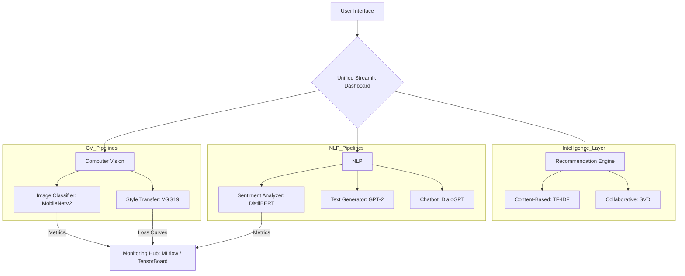

# 🤖 Advanced AI Playground: An End-to-End ML Research Lab

[](https://www.python.org/)
[](https://pytorch.org/)
[](https://huggingface.co/docs/transformers/index)
[](https://mlflow.org/)
[](https://streamlit.io/)

A professional, modular repository demonstrating production-grade implementation of state-of-the-art Deep Learning models across **Computer Vision**, **Natural Language Processing**, and **Recommendation Systems**. This project serves as an end-to-end laboratory for experiment tracking, transfer learning, and interactive model deployment.

---

## 🏗️ Architectural Excellence

The Playground is architected with **modularity** and **scalability** as primary constraints. Each experiment is self-contained with its own training pipeline and inference logic, unified by a central logging and monitoring system.



---

## 🚀 Key Technical Highlights

### 🧿 Computer Vision
*   **Transfer Learning Optimization**: Leveraged pre-trained `MobileNetV2` and `VGG19` weights to achieve high accuracy on target datasets (CIFAR-10) with minimal compute budget.
*   **Neural Style Transfer**: Implemented Gram Matrix-based style loss optimization for artistic image synthesis.

### 🧠 Natural Language Processing
*   **Transformer Fine-Tuning**: Production-grade implementation of HuggingFace `Trainer` API for `DistilBERT` (Sequence Classification) and `GPT-2` (Causal LM).
*   **Conversational AI**: Integrated `DialoGPT-medium` for interactive, context-aware chatbot experiences.

### 🎯 Recommendation Systems
*   **Hybrid Strategy**: Implementation of both Content-Based filtering (TF-IDF Similarity) and Collaborative filtering (SVD Latent Factor Analysis).

### 📊 MLOps & Experiment Tracking
*   **Full Observability**: Integrated **MLflow** for hyperparameter/artifact tracking and **TensorBoard** for real-time visualization of loss gradients and accuracy curves.

---

## 🛠️ Getting Started

### 1. Prerequisites
Ensure you have Python 3.8+ installed.

### 2. Implementation
```bash
# Clone the repository
git clone https://github.com/hemahariharan1126/ai-playground.git

# Initialize environment
python -m venv venv
source venv/bin/activate  # Windows: .\venv\Scripts\activate

# Install production-grade dependencies
pip install -r requirements.txt
```

### 3. Execution
| Module | Command |
| :--- | :--- |
| **Unified UI** | `streamlit run demo_apps/app.py` |
| **MLflow UI** | `mlflow ui` |
| **TensorBoard** | `tensorboard --logdir logs` |

---

## 🗺️ Project Roadmap
- [x] **Phase 1-5**: Foundational CV and NLP Module Implementation
- [x] **Phase 7-8**: Advanced Recommendation Systems and Unified Dashboard
- [x] **Phase 9**: Full MLOps Integration (Tracking & Monitoring)
- [x] **Phase 10**: Professional Portfolio Documentation
- [ ] **Next**: Dockerization and Cloud Deployment (AWS/Azure)

---
*Built for excellence in AI Research and Software Engineering.*
